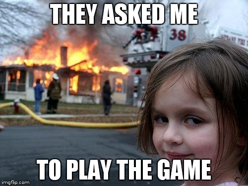
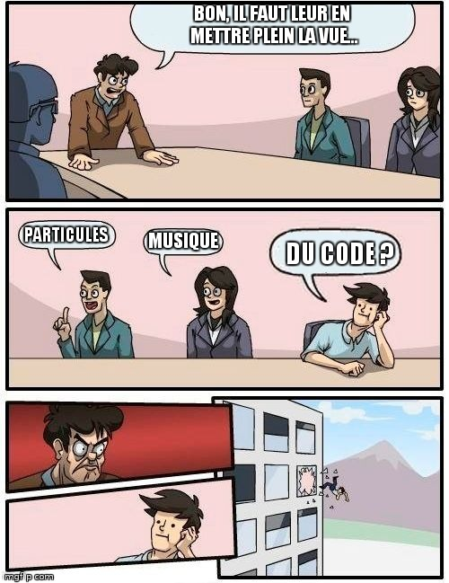
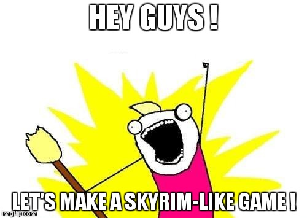

\maketitle

# Gestion du groupe

## Gestion du groupe

> - Affinités
> - Niveaux homogènes
> - Inters = anglais
> - 4 membres
> - Ou moins...

## 

## Gestion du groupe

> - Choix du projet
> - Choix du chef
> - Répartir les tâches

# Rapports

## Rapports

> - Cahier des Charges
> - 2 rapports intermédiaires
> - Final : 1 rapport
> - Ou plus...

## How to LaTeX

> - Répartir
> - Git
> - Éditeurs en ligne (Overleaf)
> - Intermédiaires : 20 pages
> - Final : 50 pages
> - Images

## Images

## How to LaTeX
> - Le manuscrit de Didier Verna

# Soutenances

## Soutenances

> - Se préparer
> - Savoir de quoi on parle
> - Pingouins

## Pingouins

## Soutenances
> - Cohérence de la tenue
> - Time
> - 4 men => 4 laptops
> - Cacher les bugs
> - Ne pas faire jouer les profs

## Game Over

## Soutenances

> - Test.
> - 2 soutenances intermédiaires
> - 2 soutenances finales
> - Ou plus...
> - Eviter de montrer le code

## Eviter de montrer le code

## Soutenances

> - Total : 4 soutenances
> - Ou plus...
> - Goodies
> - Prévoir (réseau)
> - Bullshiiiiit

## Bullshit

# Gestion du projet \& Protips

## Gestion du projet

> - Être réaliste

## Soyez réalistes !

## Gestion du projet

> - Un graphiste qui graphe c'est bien
> - Un graphiste qui code, c'est mieux
> - .gitignore/.unityPackage
> - Communiquez !

## Protips
> - Site web local
> - Krisboul SAIT
> - Gollum GROGNE
> - Krisboul connaît Gollum
> - Attention

## Attention

# Sources

## Sources

